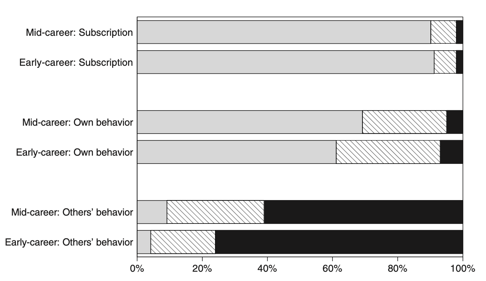
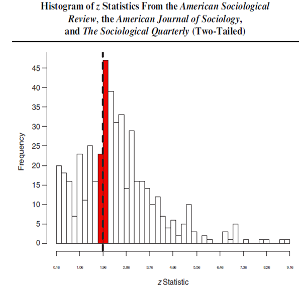

# Investigación Ética {#inv_etica}

En este capítulo discutiremos el `ethos` de la investigación, es decir, los valores que deberían guiar la práctica científica.  La ética en la investigación es fundamental para garantizar que el conocimiento generado sea confiable, válido y beneficioso para la sociedad. En este contexto, las normas mertonianas, propuestas por el sociólogo Robert K. Merton en 1942, representan uno de los marcos más influyentes y perdurables en la discusión sobre la ética en la investigación.

Merton veía la ciencia como un sistema extremadamente eficiente para producir conocimiento, y su discusión sobre el `ethos` de la ciencia fue un esfuerzo por explicar por qué la ciencia funcionaba tan bien. Los investigadores han sostenido durante mucho tiempo que los valores de apertura y replicación son fundamentales para lo que hacen, pero en la práctica  no siempre ha estado a la altura de esos ideales. 

Merton situaba a los científicos en un sistema social con un conjunto de normas y describía los incentivos que enfrentan los investigadores individuales al actuar dentro de esa estructura. Las normas tienen un carácter dual: los incentivos proporcionados por un sistema bien estructurado apoyan un comportamiento que se adhiere a las normas, pero el sistema también funciona porque los actores internalizan las normas: las aceptan. Los cuatro valores fundamentales de la investigación científica que Merton articula son *universalismo*, *comunalidad*, *desinterés* y *escepticismo organizado*.

Las normas mertonianas proporcionan un marco ético esencial para la práctica de la ciencia, asegurando que la búsqueda del conocimiento se realice de manera justa, abierta y responsable. Es seguro decir que muchos (si no la mayoría) de los estudiantes de posgrado, donde nos incluimos, nunca reciben una formación formal en el `ethos` de la investigación científica que Merton discute. En la mayoría de los casos, los estudiantes simplemente asimilan los valores, expectativas y normas predominantes de los investigadores a través de su asesor, otros profesores y compañeros de estudio. Los aspirantes a científicos sociales a menudo simplemente absorben elementos del `ethos científico mientras interactúan con colegas, pero existe la preocupación de que también se puedan transmitir lecciones negativas de esta manera.   Al adherirse a estos principios, los científicos contribuyen no solo al avance del conocimiento, sino también al bienestar y al progreso de la sociedad en su conjunto. A continuación, exploraremos las normas mertonianas para una investigación ética.

## Normas mertonianas para una investigación ética

### Universalismo

El principio del universalismo es uno de los pilares fundamentales en la ética de la investigación científica según las normas mertonianas. Esta norma sostiene que las afirmaciones científicas deben evaluarse con criterios impersonales y universales, sin importar quién las haga. El conocimiento científico debe ser juzgado únicamente por su validez y mérito intrínseco, independientemente de la nacionalidad, género, religión, posición social o cualquier otra característica personal del científico.

El universalismo es crucial porque promueve la objetividad y la equidad en la evaluación de los descubrimientos científicos. Al aplicar criterios universales, se asegura que el conocimiento científico sea accesible y evaluado de manera justa, evitando los prejuicios y la discriminación. Este principio fomenta un entorno en el que las ideas y los resultados pueden ser evaluados y aceptados basándose en evidencia empírica y razonamiento lógico, no en la autoridad o el prestigio del investigador.

Una implicación importante es que las sociedades que promueven la igualdad de oportunidades educativas pueden experimentar un progreso científico más rápido. Cuando personas de diversos orígenes, independientemente de su género, etnia, religión, sexualidad o antecedentes académicos, pueden participar en la investigación, se enriquece el aprendizaje y el avance científico. Restringir el acceso a la formación científica excluye a grupos completos, empobreciendo el esfuerzo científico. 

A pesar de su importancia, la implementación del universalismo no está exenta de desafíos. Los prejuicios implícitos, las redes de poder y la desigualdad de recursos entre diferentes grupos y regiones pueden influir en la visibilidad y la aceptación de ciertos trabajos científicos. Además, la accesibilidad a recursos como financiamiento, equipos y formación avanzada puede variar significativamente, afectando la capacidad de algunos investigadores para contribuir al conocimiento científico global.

### Comunalismo

Este principio sostiene que los resultados del trabajo científico deben ser compartidos libremente con la comunidad científica y con la sociedad en general. En otras palabras, el conocimiento generado a través de la investigación científica no debe ser propiedad exclusiva del investigador, sino que debe ser un bien común accesible para todos.

En otras palabras, y en marcado contraste con muchas otras formas de propiedad fuera de la investigación, el `ethos` científico exige que el conocimiento generado por la investigación pertenezca a toda la comunidad y no solo a quienes lo descubren.

El comunalismo es vital porque promueve la transparencia, la colaboración y el progreso continuo en la ciencia. Al compartir los resultados y los datos de la investigación, se facilita la verificación de los hallazgos, la replicación de los estudios y la acumulación colectiva de conocimientos. Esta práctica también fomenta un ambiente de colaboración en lugar de competencia desleal, permitiendo a los científicos construir sobre el trabajo de otros y acelerar el avance científico.

A pesar de sus beneficios, el comunalismo enfrenta varios desafíos. Entre ellos se encuentran la protección de la propiedad intelectual, ya que los investigadores y las instituciones a veces son reacios a compartir sus resultados debido a preocupaciones sobre la propiedad intelectual y los derechos de autor. Además, los costos de publicación en revistas de acceso abierto pueden ser elevados, lo que limita la capacidad de algunos investigadores para compartir sus hallazgos. Por último, la competencia académica y la presión por publicar y obtener financiación pueden llevar a algunos investigadores a ser menos abiertos con sus datos y resultados.

### Desinterés

La norma mertoniana del desinterés en la investigación ética establece que los científicos deben actuar con imparcialidad y objetividad, buscando el conocimiento por el bien común y no por beneficios personales o intereses privados. En otras palabras, los científicos deben estar motivados por la curiosidad intelectual y el deseo de contribuir al conocimiento colectivo, en lugar de por ganancias personales, fama o poder. Este principio implica también que el investigador ético debe informar los resultados tal como son, incluso si esto perjudica su reputación, contradice el conocimiento establecido o enfada a otras personas.

El desinterés es crucial para mantener la integridad y la credibilidad de la ciencia. Cuando los científicos se adhieren a este principio, se reduce el riesgo de sesgos, manipulaciones de datos y conflictos de interés que pueden distorsionar los resultados y comprometer la calidad de la investigación. El desinterés fomenta la confianza pública en la ciencia, asegurando que los hallazgos y conclusiones sean genuinos y basados en evidencias sólidas.

Sin embargo, a pesar de su importancia, la implementación del desinterés enfrenta varios desafíos. Los investigadores pueden enfrentar presiones externas de patrocinadores, instituciones académicas o la industria para obtener resultados favorables o que apoyen ciertos intereses. Además, la intensa competencia por financiación, publicaciones y reconocimiento puede tentar a algunos científicos a priorizar sus intereses personales sobre el bien común. Por último, no todos los conflictos de interés son fácilmente identificables o declarados, lo que puede comprometer la objetividad de la investigación.

### Escepticismo Organizado

Este principio establece que los científicos deben adoptar una actitud crítica y cuestionadora hacia las afirmaciones y teorías científicas, incluidas las propias. Una característica fundamental del enfoque de los investigadores científicos es que no deben aceptar las cosas al pie de la letra: necesitan ver pruebas.

El escepticismo organizado implica someter todas las afirmaciones a un riguroso escrutinio y verificación, promoviendo la revisión por pares, la replicación de estudios y la evaluación continua de los resultados. Esto significa que los científicos no deben limitarse a temas socialmente aceptables ni a lo que las autoridades consideran adecuado estudiar: el ideal es examinar críticamente todo.

A pesar de sus beneficios, el escepticismo organizado enfrenta varios desafíos. Los científicos pueden tener sesgos personales o estar influenciados por la opinión dominante en su campo, lo que puede dificultar la evaluación objetiva de nuevas ideas. Además, la presión por publicar rápidamente y obtener financiación puede llevar a algunos investigadores a no someter sus trabajos a un escrutinio suficientemente riguroso. Asimismo, las ideas verdaderamente innovadoras pueden ser rechazadas inicialmente por la comunidad científica debido a su novedad y a la dificultad de encajarlas en el paradigma existente. Estos desafíos resaltan la importancia de mantener un equilibrio entre el escepticismo y la apertura a nuevas perspectivas en la investigación científica. 

En última instancia, el escepticismo organizado no solo fortalece la calidad de la ciencia, sino que también fomenta un entorno en el que las ideas pueden ser rigurosamente probadas y evaluadas, garantizando que solo las teorías más robustas y bien fundamentadas sean aceptadas. Este enfoque crítico y abierto es esencial para el avance del conocimiento y para asegurar que la ciencia continúe siendo una herramienta confiable y efectiva para comprender el mundo.

## Normas en la práctica

Una camino para entender lo que piensa y hacen los investigadores es preguntarles directamente. Esto es lo que hicieron @anderson2007normative en su trabajo titulado "Normative dissonance in science: Results from a national survey of US scientists". En este trabajo investigaron la disonancia normativa en la ciencia, es decir, la discrepancia entre los ideales normativos ampliamente aceptados y las percepciones de los científicos sobre su propio comportamiento y el de otros. Para ello utilizando respuestas de una encuesta a 3,247 científicos en etapas iniciales y en la mitad de sus carreras, financiados por los Institutos Nacionales de Salud (NIH) de EE. UU. El NIH financia una amplia gama de investigadores, desde científicos de laboratorio en investigación biomédica hasta científicos sociales en muchas disciplinas cuyo trabajo trata temas de salud. Entonces, aunque no es una muestra completamente representativa de todos los académicos, sí cubre una gran variedad de campos.

En este trabajo ademas de preguntarle sobre  las cuatro normas de Merton, agrego dos valores adicionales: *Gobernanza* y *Calidad*. Al mismo tiempo emparejó  cada uno con una "contranorma" que los académicos han identificado como existentes en la comunidad investigadora. Estas seis parejas de normas y contranormas se describen en la  tabla \@ref(tab:normascontranormas). Por ejemplo, la contranorma del *universalismo* es el *particularismo*, que representa una falta de apertura a diferentes tipos de personas o investigadores, y específicamente la creencia de que la evidencia científica debe ser juzgada principalmente en función del historial de investigación del investigador en lugar de la calidad de la evidencia en sí.

### Normas y Contranormas en la Ciencia {#tab:normascontranormas}

| **Norma**                | **Descripción**                                                                        | **Contranorma**          | **Descripción**                                                                  |
|--------------------------|----------------------------------------------------------------------------------------|--------------------------|----------------------------------------------------------------------------------|
| **Universalismo**        | Los científicos evalúan la investigación solo en función de su mérito.                 | **Particularismo**       | Los científicos evalúan el nuevo conocimiento y sus aplicaciones basándose en la reputación y productividad pasada del individuo o grupo de investigación. |
| **Comunalismo**          | Los científicos comparten abiertamente sus hallazgos con colegas.                      | **Secretismo**              | Los científicos protegen sus hallazgos más recientes para asegurar prioridad en la publicación, patente o aplicaciones. |
| **Desinterés**        | Los científicos están motivados por el deseo de conocimiento y descubrimiento.         | **Interés**           | Los científicos compiten con otros en el mismo campo por financiamiento y reconocimiento de sus logros. |
| **Escepticismo Organizado** | Los científicos consideran todas las nuevas evidencias, hipótesis, teorías e innovaciones, incluso aquellas que desafían o contradicen su propio trabajo. | **Dogmatismo Organizado** | Los científicos invierten sus carreras en promover sus hallazgos, teorías o innovaciones más importantes. |
| **Gobernanza**           | Los científicos son responsables de la dirección y control de la ciencia a través de la gobernanza, la autorregulación y la revisión por pares. | **Administración**       | Los científicos dependen de los administradores para dirigir la empresa científica a través de decisiones de gestión. |
| **Calidad**              | Los científicos juzgan las contribuciones de los demás a la ciencia principalmente en función de la calidad. | **Cantidad**             | Los científicos evalúan el trabajo de los demás principalmente en función del número de publicaciones y subvenciones. |
*Nota: Esta tabla fue adaptada de* @anderson2007normative

La figura  \@ref(fig:anderson_fig) muestra los porcentajes de los científicos en dos etapas de su carrera (inicio y mitad) que tienen puntuaciones normativas y contranormativas en tres categorías: suscripción, comportamiento propio y comportamiento de otros.

###  Normas versus contranormas en la práctica {#fig:anderson_fig}

*Nota: Esta figura fue tomada de* @anderson2007normative 

Esta figura subraya la desconexión entre las normas a las que los científicos suscriben y lo que perciben como el comportamiento típico, especialmente en el comportamiento de otros científicos, lo que refleja la disonancia normativa en el entorno de investigación. En cuanto a la **Suscripción a Normas (Subscription)**, la mayoría (aproximadamente 90%) de los científicos en la etapa de **Mitad de Carrera** suscriben a las normas (barra gris), con muy pocos teniendo puntuaciones iguales (rayada) o menores (negra) en comparación con las contranormas. Para los científicos en **Inicio de Carrera**, la situación es similar: una gran mayoría suscribe a las normas, con pocos teniendo puntuaciones iguales o menores en comparación con las contranormas. En términos de **Comportamiento Propio (Own Behavior)**, aunque la mayoría de los científicos en Mitad de Carrera tienen puntuaciones normativas mayores que las contranormativas, hay una proporción significativa con puntuaciones iguales o menores en comparación con las contranormas. Este patrón se repite en los científicos en Inicio de Carrera, pero con una mayor proporción de científicos con puntuaciones iguales o menores en comparación con las contranormas. Respecto al **Comportamiento de Otros (Others' Behavior)**, una mayoría de los científicos en Mitad de Carrera perciben el comportamiento típico de otros científicos como más contranormativo que normativo. Esta percepción es aún más marcada entre los científicos en Inicio de Carrera, con una gran mayoría percibiendo el comportamiento de otros como más contranormativo que normativo. 

Existe una disonancia significativa entre los ideales normativos y las percepciones del comportamiento real, tanto propio como de otros, siendo más pronunciada en la percepción del comportamiento de otros científicos. Los científicos en ambientes más competitivos tienden a ver un comportamiento más contranormativo, lo cual crea una fuente persistente de tensión y estrés en la comunidad científica. Esta figura subraya la desconexión entre las normas a las que los científicos suscriben y lo que perciben como el comportamiento típico, especialmente en el comportamiento de otros científicos, lo que refleja la disonancia normativa en el entorno de investigación. Sin embargo, surge la pregunta de cuál parte de la figura deberíamos creer: la parte media, que es mixta pero en general apoya las normas, o la parte inferior, que presenta una visión pesimista del campo de la investigación en su conjunto. Es posible que la última sea demasiado pesimista. Tal vez todos escuchan sobre unos pocos "casos malos", como los casos de fraude discutidos en el primer capítulo, y a partir de ahí condenan injustamente el estado de la ética en todo su campo.

## Problemas

En el trabajo empírico una preocupación importante son los falsos positivos, que como ilustra @ioannidis2005most es un problema mucho más importante que lo que se había pensado previamente. El problema de falsos positivos está íntimamente ligado al sesgo de publicación y búsqueda de especificación. Un ejemplo humorístico, pero muy ilustrativo de esta problemática, es el cómic de XKCD titulado "Significant". En este cómic, un grupo de investigadores prueba la hipótesis de que comer jellybeans causa acné, realizando múltiples pruebas con diferentes colores de jellybeans. Después de 20 pruebas, finalmente encuentran un color (verde) que muestra una asociación significativa con el acné, aunque esta asociación sea un falso positivo debido al simple azar.

Este escenario refleja claramente el problema del sesgo de publicación y la búsqueda de especificación. El sesgo de publicación ocurre cuando algunos estudios son más propensos a ser publicados que otros en función de sus resultados. En el caso de los jellybeans, si consideramos que se realizaron 20 estudios separados, sólo se publicaría aquel que mostró un resultado significativo, ignorando los otros 19 que no encontraron ninguna asociación.

La búsqueda de especificación, por otro lado, ocurre cuando los investigadores exploran múltiples formas de analizar los datos dentro de un mismo estudio, y sólo reportan aquellas que muestran resultados significativos. Si imaginamos que el investigador del cómic probó 20 formas diferentes de dividir la muestra hasta encontrar una que arrojara un resultado significativo, estaríamos frente a un caso de búsqueda de especificación. Estos dos fenómenos están estrechamente relacionados: la anticipación del sesgo de publicación por parte de los investigadores fomenta la búsqueda de especificación, ya que los investigadores se sienten presionados a encontrar resultados que sean "publicables".

John Ioannidis, en su influyente artículo *"Why Most Published Research Findings Are False"*, argumenta que debido a estos problemas, muchos de los hallazgos publicados en la literatura científica son falsos positivos. Según Ioannidis, la combinación de estudios con bajo poder estadístico, la flexibilidad en los diseños de estudio y los análisis, y el sesgo de publicación, contribuyen a una alta tasa de resultados falsos en la investigación científica.

El cómic de XKCD sirve como una representación visual simple pero potente de estos problemas. Nos recuerda que debemos ser críticos con los resultados publicados y conscientes de los sesgos y prácticas que pueden distorsionalos. Al abordar estos problemas, es esencial mejorar la transparencia en la investigación, promover la publicación de todos los resultados, y adoptar prácticas estadísticas más rigurosas para reducir la prevalencia de falsos positivos y fortalecer la fiabilidad de nuestros hallazgos.

<b> Falsos Positivos en Tests de Hipótesis </b>

Una hipótesis (por ejemplo, "El aumento del salario mínimo está asociado con una disminución en la tasa de desempleo") es verdadera o falsa en el mundo real. Debido a que el investigador no puede estudiar a todas las personas afectadas, debe probar la hipótesis en una muestra de esa población objetivo. No importa cuántos datos recoja el investigador, nunca podrá probar (o refutar) su hipótesis de manera absoluta. Siempre existirá la necesidad de hacer inferencias sobre los fenómenos en la población a partir de los eventos observados en la muestra [@banerjee2009hypothesis]. Los errores son inevitables hasta cierto punto en el proceso de tests de hipótesis debido a las limitaciones inherentes a la investigación y al análisis de datos. 

Por ejemplo, pensemos en la siguiente analogía, al igual que un juez en un juicio, el investigador debe tomar una decisión basada en la evidencia disponible. Un juez comienza presumiendo la inocencia del acusado y solo rechaza esta presunción si hay pruebas suficientes más allá de una duda razonable. De manera similar, el investigador empieza asumiendo la hipótesis nula (\(H_0\)). Utilizando pruebas estadísticas, el investigador debe determinar si hay suficiente evidencia para rechazar \(H_0\) en favor de la hipótesis alternativa (\(H_1\)). Aun así, siempre existe la posibilidad de error, condenando a un inocente (error de Tipo I) o liberando a un culpable (error de Tipo II), lo cual refleja la naturaleza incierta de la inferencia estadística.

Podemos resumir este proceso en la siguiente tabla de contingencia:

| Decisión sobre \(H_0\) | La hipótesis nula (\(H_0\)) es verdadera | La hipótesis nula (\(H_0\)) es falsa |
|-------------------------|-----------------------------------------|--------------------------------------|
| No rechazar \(H_0\)     | Inferencia correcta (verdadero negativo) (probabilidad = \(1−\alpha\)) | Error de Tipo II (falso negativo) (probabilidad = \(\beta\)) |
| Rechazar \(H_0\)        | Error de Tipo I (falso positivo) (probabilidad = \(\alpha\)) | Inferencia correcta (verdadero positivo) (probabilidad = \(1−\beta\)) |

En el contexto de los tests de hipótesis, un falso positivo ocurre cuando se rechaza incorrectamente la hipótesis nula (\(H_0\)) a favor de la hipótesis alternativa (\(H_1\)). En otras palabras, el test indica un resultado significativo cuando, en realidad, no lo es. Este error es conocido como error de Tipo I y se denota por \(\alpha\), que representa la probabilidad de cometer un falso positivo.

En otras palabras, si el test no lleva a  **No rechazar \(H_0\)** puede ser que estemos:
   - Haciendo: **Inferencia correcta (verdadero negativo) (probabilidad = \(1−\alpha\))**: La prueba correctamente no rechaza \(H_0\) cuando \(H_0\) es verdadera. Es la probabilidad de no cometer un error de Tipo I.
   - Cometiendo **Error de Tipo II (falso negativo) (probabilidad = \(\beta\))**: La prueba no rechaza \(H_0\) cuando \(H_1\) es verdadera. Este es el error de Tipo II.

En casos contrario, si **Rechazamos \(H_0\)** puede que estemos:
   - Cometiendo **Error de Tipo I (falso positivo) (probabilidad = \(\alpha\))**: La prueba incorrectamente rechaza \(H_0\) cuando \(H_0\) es verdadera. Esta es la tasa de error de Tipo I.
   - Haciendo **Inferencia correcta (verdadero positivo) (probabilidad = \(1−\beta\))**: La prueba correctamente rechaza \(H_0\) cuando \(H_1\) es verdadera. Esta es la potencia del test, que es 1 menos la probabilidad de cometer un error de Tipo II (\(\beta\)).

En resumen, los falsos positivos (\(\alpha\)) son situaciones donde el test sugiere incorrectamente la existencia de 

### Modelo conceptual para aproximar estos problemas

Un modelo muy útil para entender estos problemas claves fue desarrollado por @ioannidis2005most en su artículo *"Why Most Published Research Findings Are False"*. Este artítculo proporciona un marco teórico para entender por qué una gran proporción de los hallazgos científicos pueden ser falsos positivos. Este modelo se fundamenta en la estadística bayesiana y en varias consideraciones prácticas del proceso de investigación.

Específicamente este modelo estima el valor predictivo positivo (*positive predictive value o PPV*) de la investigación. Esto es simplemente la  probabilidad post-hoc de que un resultado sea verdadero condicional a que el test de hipótesis es significativo. Es decir

$$
PPV = Pr(V | S)
$$
donde $V$ indica que la hipótesis es verdadera, y S que el resultado del test estadístico es significativo, es decir, si $T$ es el test estadístico observado y $\tau_{\alpha}$  es el punto de corte relevante, tenemos que $T>\tau_{\alpha}$.

Definamos $R$ como la relación entre el número de “relaciones verdaderas” y “ninguna relación” entre las hipótesis comúnmente estudiadas en una disciplina. A partir de ella podemos definir que la probabilidad de que una relación verdadera para una dada hipótesis exista **antes** que un estudio sea llevado a cabo.

$$
P(V) = \frac{R}{R+1}
$$

podemos entonces usar el teorema de Bayes y la tabla de contingencia del recuadro anterior para derivar la $PPV$

\[ P(V | S) = \frac{P(S | V) \cdot P(V)}{P(S)} \]

Con esto tenemos que $P(S | V)$, la probabilidad de obtener un resultado significativo si el hallazgo es verdadero, es $1 - \beta$ y que $P(S | F)$, la  probabilidad de obtener un resultado significativo si el hallazgo es falso, es $\alpha$. Con un poco de matematica obtenemos que

\[PPV =  P(V | S) = \frac{(1 - \beta) \cdot R}{(1 - \beta) \cdot R + \alpha } \]

De la ecuación, se puede ver que cuanto mayor sea la potencia del estudio (mayor \(1 - \beta\)) y más estricto sea el nivel de significancia estadística (menor \(\alpha\)), más cercano estará el $PPV$ a 1, eliminando en gran medida los falsos positivos. Al nivel de significancia usual de \(\alpha = 0.05\) y en un estudio bien potenciado (\(1 - \beta = 0.80\)) en una literatura donde se piensa que un tercio de todas las hipótesis son verdaderas ex ante (\(R_i = 0.5\)), el $PPV$ es relativamente alto, alcanzando un 89 por ciento.

Sin embargo, la realidad es considerablemente más complicada y, como describe @ioannidis2005most, podría llevar a tasas mucho más altas de falsos positivos en la práctica debido a la presencia de estudios con bajo poder estadístico, búsqueda de especificaciones, sesgo del investigador y el sesgo de publicación,

Discutimos estas extensiones a continuación. Empezamos con el tema del poder estadístico. En economía empírica, @doucouliagos2012estimates, @ioannidis2017power, y otros han documentado que los estudios, en la práctica, tiene bajo poder estadístico. Por ejemplo, @ioannidis2017power argumenta que el poder mediano de los estudios en economía es alrededor del 18% lo que implica que el PPV es de $64\%$, es decir que el $36\%$ de los resultados son falsos positivos. Más aun si se utilizan rutinariamente estudios con baja potencia para probar hipótesis que probablemente son falsas, la tasa de falsos positivos puede superar el 50 por ciento (por ejemplo, poder = 0.20 y $R_i = 0.2$ da un $PPV = 0.44$).

Este problema, y otros más, se ven exacerbadas si existe sesgo de publicación. @ioannidis2005most extieende el  modelo para incluir la posibilidad de sesgo del investigador, que peude tomar varias formas incluidas cualquier combinación de manipulación de datos, búsqueda de especificaciones, informes selectivos, e incluso fraude. Si incorporamos este sesgo como un termino $u$, la expresión anterior queda

$$
PPV= \frac{(1 - \beta) \cdot R + u \beta R}{(1 - \beta) \cdot R + \alpha + u\beta R + u(1- \alpha)} 
$$
Aquí, el número real de relaciones verdaderas (el numerador) permanece casi sin cambios, aunque hay un término adicional que captura los efectos del sesgo del investigador.  Si volvemos al caso de  \(R_i = 0.5\), y el nivel de significancia usual del 5 por ciento, pero ahora asumimos que el sesgo del autor es relativamente bajo, al 10 por ciento, el $PPV$ cae del 83 por ciento al 65 por ciento. Si el 30 por ciento de los autores presentan sesgo en su presentación de resultados, el $PPV$ cae dramáticamente al 49 por ciento, lo que significa que la mitad de los efectos significativos reportados son en realidad falsos positivos.
 
La figura \@ref{fig:ppv}, obtenida de @ioannidis2005most, presenta una gama de valores de parámetros y el $PPV$ resultante. El término \(R_i\) puede variar entre campos de investigación, donde las literaturas que están en una etapa más temprana y, por lo tanto, más exploratoria, presumiblemente tienen menores probabilidades de relaciones verdaderas.

#### Valor predictivo positivo para distintas comibnaciones de parámetros {#fig:ppv}

*Nota: Esta figura fue tomada de* @ioannidis2005most 

Este marco simple resalta varios de los problemas de la investigación empírica, con el mismo @ioannidis2005most concluyendo que la mayoría de los hallazgos publicados en medicina probablemente sean falsos. Esto es posible que también suceda en otras disciplinas aunque es difícil hacer una afirmación similar dada la dificultad de cuantificar algunos de los parámetros clave en el modelo. Sin embargo, este ejercicio plantea preocupaciones importantes sobre la fiabilidad de los hallazgos en muchas campos.

Con este marco en mente, veamos evidencia empírica de múltiples campos que sugieren la presencia de sesgo de publicación y otros de los problemas anteriormente discutidos para luego presentar soluciones para resolverlos.

### Evidencia del problema

#### Sesgos de publicación

El sesgo de publicación surge si el resultado de un estudio influye sistemáticamente en su probabilidad de ser publicado. Usualmente, se espera que este sesgo funcione en contra de los estudios que no rechazan la hipótesis nula, ya que estos típicamente "serían" menos interesantes de ser publicados. 

Sin embargo, si como investigadores somos incapaces de rastrear el cuerpo completo de pruebas estadísticas que se han realizado, incluidas aquellas que no rechazan la nula (y, por lo tanto, son menos probables de ser publicadas), entonces no podemos determinar la verdadera proporción de pruebas en una literatura que rechazan la nula. Por lo tanto, es crucial entender cuántas pruebas y análisis se han realizado en toda la comunidad académica.

@sterling1959publication en un breve artículo fue el primero en señalar el problema, advirtiendo que "cuando se usa un nivel fijo de significancia como criterio crítico para seleccionar que resultados difundir, puede resultar en resultados imprevistos." Mas recientemente @franco2014publication documentaron que una gran parte de los análisis empíricos en las ciencias sociales nunca se publican o ni siquiera se escriben, y que la probabilidad de que un hallazgo sea compartido con la comunidad en general disminuye drásticamente para los "hallazgos nulos" (es decir, hallazgos que no son estadísticamente significativos). @franco2014publication examinaron los estudios que pasaron la revisión por pares y fueron incluidos en la encuesta TESS (time-sharing experiments for the social sciences) financiados por la National Science Foundation.

TESS financió estudios en diversos campos de las ciencias sociales y @franco2014publication rastrearon con éxito casi todos los estudios originales a lo largo del tiempo, registrando la naturaleza de los resultados empíricos así como la publicación final del estudio. La figura \@ref{fig:mervis} resume los resultados hallados.

#### Mayoria de resultados nulos nunca son publicados{#fig:merivs}

*Nota: Esta figura fue tomada de* @mervis2014null

La figura muestra un patrón empírico sorprendente: los estudios donde la prueba principal de hipótesis arrojó resultados nulos tienen 40 puntos porcentuales menos de probabilidad de ser publicados en una revista que un resultado fuertemente significativo, y 60 puntos porcentuales menos de probabilidad de ser escritos. Este hallazgo tiene implicaciones potencialmente severas para nuestra comprensión de los hallazgos en cuerpos enteros de investigación en ciencias sociales, si los ceros nunca son vistos por otros académicos, incluso en forma de documento de trabajo. Esto implica que el $PPV$ de la investigación es probablemente más bajo de lo que sería de otra manera, y también tiene implicaciones negativas para la validez de los meta-análisis, si los resultados nulos no son conocidos por los académicos que intentan sacar conclusiones más amplias sobre un cuerpo de evidencia. 

####  Búsqueda de especificaciones

Estrechamente ligado al problema de sesgo de publicación está el de búsqueda de especificación. La búsqueda de especificación se refiere a la flexibilidad en el análisis de datos que permite presentar *casi cualquier resultado* bajo un umbral arbitrario. Esta práctica puede llevar a que la significancia estadística pierda su sentido, ya que los investigadores pueden ajustar su metodología hasta obtener resultados que alcancen el umbral deseado. Andrew Gelman y Erik Loken [@gelman2013garden] lo resumen de una forma muy elocuente

> Un conjunto de datos puede ser analizado de tantas formas diferentes (con las opciones que no son solo qué prueba estadística realizar sino también decisiones sobre qué datos incluir o excluir, qué medidas estudiar, qué interacciones considerar, etc.), que muy poca información es proporcionada cuando se afirma que  un estudio obtuvo un resultado p < .05.

Esta práctica también es conocida como "p-hacking", "specification searching", "data-fishing", grados de libertad del investigador, o "data-mining". Estos términos reflejan la misma preocupación: la manipulación de los datos hasta que se obtienen resultados significativos.

Es importante destacar que la búsqueda de especificación no implica necesariamente una intención maliciosa. Puede ser subconsciente o simplemente una práctica estándar del análisis estadístico [@gelman2013garden]. Los investigadores, a menudo sin darse cuenta, pueden probar múltiples enfoques analíticos y seleccionar aquellos que producen resultados estadísticamente significativos.

Hay evidencia de comportamiento anómalo de pruebas estadísticas alrededor de umbrales arbitrarios, lo que sugiere la prevalencia de la búsqueda de especificación. Esto se puede observar en los gráficos que muestran acumulaciones inusuales de resultados justo por encima de los umbrales de significancia estándar, como el valor p de 0.05.

#### Estadisticos Z de revistas academicas top{#fig:gerber}

*Nota: Esta figura fueron tomads de* @gerber2008statistical y @gerber2008publication

Estos gráficos ilustran cómo los resultados tienden a agruparse alrededor de los umbrales de significancia, lo que sugiere que los investigadores pueden estar ajustando sus análisis hasta alcanzar estos umbrales, en lugar de seguir una metodología predefinida y rigurosa.

Es importante notar, que mientras que el sesgo de publicación implica una distorsión de un cuerpo de múltiples estudios de investigación, el sesgo también es posible dentro de un estudio dado. En las décadas de 1980 y 1990, el acceso a computadores mas potentes y nuevas bases de datos ha llevado a preocupaciones crecientes de que algunos investigadores estaban realizando un número cada vez mayor de análisis y reportando selectivamente aquellos análisis que apoyaban nociones preconcebidas, o que eran vistos como particularmente interesantes dentro de la comunidad investigadora, e ignorando, conscientemente o no, otras especificaciones que no lo hacían. Las preocupaciones sobre la búsqueda de especificaciones solo se han vuelto más prominentes en  décadas mas recientes.

En resumen, la búsqueda de especificación es una práctica preocupante en el análisis de datos que puede comprometer la validez de los resultados de investigación. Es fundamental que los investigadores reconozcamos este problema y adoptemos medidas para minimizar su impacto, como pre registrar estudios y mantener una transparencia total en los procesos analíticos.

