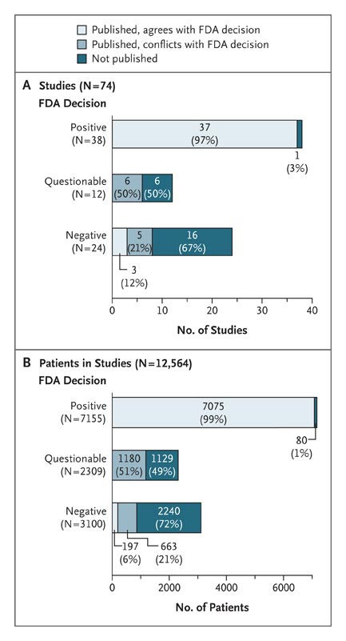
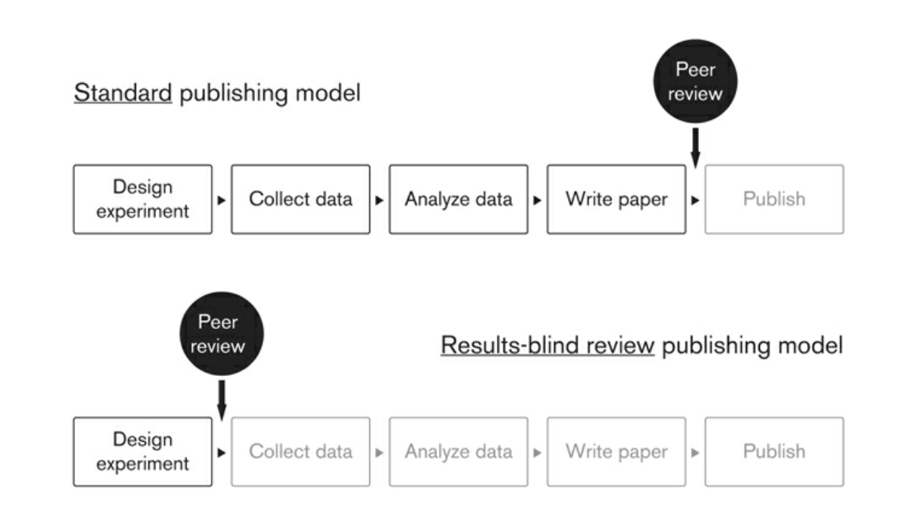

# Promoviendo Ciencia transparante  {#preanalisis}

Sabemos que los investigadores tienen mucha flexibilidad en su investigación, y esto puede llevar a sesgos en estudios individuales y en literaturas de investigación enteras. Emplear toda la investigación sobre un tema es una forma importante de limitar los problemas notados en el capítulo anterior.

La alternativa tradicional al meta-análisis es la revisión narrativa de la literatura, pero tiene importantes limitaciones. Por un lado, las revisiones de la literatura a menudo son bastante subjetivas en la práctica, lo que permite a diferentes académicos llegar a conclusiones divergentes incluso cuando se centran en la misma base de evidencia de investigación, aumentando las preocupaciones sobre el sesgo del investigador. Caracterizar sucintamente toda una literatura en forma narrativa también se vuelve difícil (si no imposible) a medida que crece el número de estudios subyacentes, haciendo que el análisis estadístico objetivo sea particularmente valioso.

Pero, ¿cómo podemos saber que estamos capturando toda la investigación relevante al llevar a cabo un meta-análisis? Los registros de estudios son una forma importante para que se descubran investigaciones existentes sobre un tema, incluso si el trabajo no termina siendo publicado en una revista.

## Registo y Planes de Analisis previos

Los investigadores clínicos en los Estados Unidos están obligados por ley desde 2007 a registrar prospectivamente los ensayos médicos en una base de datos pública y a publicar los resultados resumidos. Esto ayuda a crear un registro público de ensayos que de otro modo no se publicarían. También puede servir para la prespecificación con el fin de distinguir de manera más creíble la prueba de hipótesis de la generación de hipótesis.

Los científicos sociales han comenzado a realizar estos registros y especificar planes de preanálisis completos, aunque su adopción ha sido mas lenta y no es obligatoria.

### Registros de estudios

El registro de estudios sirve como una forma útil de buscar hallazgos de investigación sobre un tema en particular y de lidiar potencialmente con el sesgo de publicación. La mayoría de los defensores del registro de estudios también promueven la preinscripción de estudios, incluyendo planes de pre-análisis (PAPs) que pueden ser publicados y sellados con una marca de tiempo incluso antes de que se recojan o estén disponibles los datos de análisis [@miguel2014promoting]. 

Un ejemplo  de los beneficios potenciales de los registros de experimentos se presenta en  @turner2008selective, que detalla las tasas de publicación de estudios relacionados con los ensayos clínicos de fase 2 y fase 3 para 12 antidepresivos aprobados por la  Administración de Alimentos y Medicamentos de los Estados Unidos (FDA, por sus siglas en inglés) . La FDA toma una decisión interna sobre si los resultados del ensayo proporcionan evidencia de un impacto positivo del fármaco. Los autores recopilaron información sobre la decisión de la FDA para cada ensayo  así como información sobre la publicación eventual del artículo a partir de una variedad de fuentes.

La Figura \@ref{fig:turner} muestra las tasas drásticamente diferentes de publicación y el grado correspondientemente alto de sesgo de publicación. La figura muestra esencialmente todos los ensayos con resultados positivos se publicaron en revistas, aproximadamente el 50 por ciento de los estudios con resultados cuestionables se publicaron, y la mayoría de los estudios con resultados negativos (es decir, sin impacto positivo del fármaco) no se publicaron al menos cuatro años después de que el estudio se completó. En pocas palabras, la literatura publicada por sí sola proporciona una perspectiva altamente engañosa sobre la efectividad de estos fármacos.

###  Status de publicacion y decisión de la FDA {#fig:turner}

*Nota: Esta figura fue tomada de* @turner2008selective 

El registro es ahora la norma en la investigación médica para experimentos aleatorios, y los registros a menudo incluyen (o enlazan a) planes de análisis estadístico prospectivo como parte del protocolo del proyecto. 

### Planes de Analisis previos

#### ¿Qué incluir en un Planes de Análisis Previo (PAP)?

Basándonos en la lista de verificación de la FDA, y las sugerencias de @christensen2019transparent  los PAPs en ciencias sociales deben considerar los siguientes 10 puntos:

1. **Diseño del Estudio**. Indicar cuántos brazos tiene el estudio, si los tratamientos múltiples son mutuamente excluyentes o superpuestos, y cómo se realiza o estratifica exactamente la aleatorización. Si el estudio no es un experimento aleatorizado, debemos expecificar el método de diseño a utilizar (por ejemplo, controlando por observables, regresión discontinua, variables instrumentales, datos de panel con efectos fijos, diferencias en diferencias, etc.).

2. **Muestra del Estudio**. ¿Quién será incluido y excluido del estudio? Los investigadores deben describir cómo se manejarán las variaciones de la muestra prevista (por ejemplo, deserción, incumplimiento con el tratamiento asignado, datos faltantes). Se deben proporcionar detalles sobre el uso de múltiples encuestas o fuentes de datos (por ejemplo, seguimientos repetidos) o múltiples años de datos administrativos.

3. **Medidas de Resultado**. Definir las medidas de resultado del estudio y declarar cuáles son de importancia primaria y secundaria, basándose en los objetivos e hipótesis de investigación del estudio. Definir cuidadosamente estas medidas refiriéndose a variables específicas de la encuesta. Si se utiliza más de una pregunta de la encuesta para construir un resultado, indicar exactamente cómo se combinarán estas variables. 

4. **Familias de Efectos**. Si se planea tener multiples variables de resultados se debe considerar agrupar los resultados en familias. El PAP debe enumerar los conjuntos exactos de resultados que comprenden las familias, así como las preguntas de la encuesta u otras fuentes de datos que componen las variables y resultados.

5. **Ajuste de Pruebas de Múltiples Hipótesis**. Debe especificarse y tenerse en cuenta explícitamente ajustando los valores p (*p-values*), ya sea controlando la tasa de error familiar (FWER) o la tasa de descubrimiento falso (FDR). El PAP debe incluir una descripción de cómo se hará esto, incluyendo exactamente qué hipótesis serán consideradas en el ajuste.

6. **Subgrupos**. Los resultados a menudo se interrelacionan con las características basicas para probar efectos heterogéneos del tratamiento. Dado que esencialmente cada características que contiene un conjunto de datos podría usarse para evaluar estos efectos heterogéneos del tratamiento, independientemente de si hay o no una teoría razonable detrás de un efecto diferencial, los subgrupos son especialmente importantes para preespecificar en un PAP. Debemos enumerar cada subgrupo a ser probado, vinculándolos a preguntas específicas de la encuesta o variables. El problema de la multiplicidad de subgrupos también puede abordarse utilizando métodos FWER y FDR, y si este es el plan del investigador, el PAP debe indicarlo explícitamente.

7. **Dirección del Efecto**. Una ventaja de escribir un PAP es el mayor poder de las pruebas estadísticas unilaterales. Siempre que la dirección, idealmente con alguna explicación del mecanismo o teoría del cambio, sea preespecificada, una prueba unidireccional es estadísticamente válida.

8. **Especificación Estadística Exacta**. ¿Cuál es la especificación exacta que se utilizará en una prueba de hipótesis? Por ejemplo, si se va a realizar una regresión, el PAP debe indicar si la regresión es lineal, lineal generalizada (Poisson, binomial negativa, etc.) u otra forma; qué variables de control, efectos fijos, y demás serán incluidos; y cómo se calcularán los errores estándar (robustos a la heterocedasticidad, agrupados, bootstrap, método delta, u otros). En otras palabras, se debe presentar una ecuación estadística con una descripción explícita de los supuestos de distribución relevantes.  Pero dada la flexibilidad que existe al elegir una especificación de regresión ex post, este aspecto del PAP es esencial.

9. **Modelo Estructural**. Si está probando un modelo estructural, es decir, construyendo un modelo matemático formal desde los primeros principios de maximización de utilidad y estimando parámetros del modelo estructural, como a veces hacen los economistas, debe asegurarse de incluir una discusión detallada de su enfoque. La forma funcional de una función de utilidad o ecuación de maximización de beneficios está sujeta al menos a tanta flexibilidad post hoc como lo está la regresión estándar.

10. **¡Marca de Tiempo!** Es importante que el plan pueda ser comprobado que fue realizado previo al estudio.

Los planes de pre-análisis todavía son nuevos en las ciencias sociales, y esta lista probablemente evolucionará en los próximos años a medida que los investigadores exploren el potencial y las posibles limitaciones de esta nueva herramienta. Pero esta lista es un muy buen punto de partida. Para aquellos preocupados por la posibilidad de que se les anticipe en nuevos diseños de investigación y preguntas a partir de los PAPs o descripciones de proyectos publicados públicamente, varios de los registros de ciencias sociales actualmente permiten el embargo temporal de los detalles del proyecto. Por ejemplo, el registro de la AEA permite a un usuario ocultar ciertos detalles del estudio hasta el final del embargo.

#### PAPs y los Reportes Registrados

Los Reportes Registrados (*Registered Reports*) son un formato de publicación que enfatiza la importancia de la pregunta de investigación y la calidad de la metodología al realizar la revisión por pares antes de la recopilación de datos. Los autores primero escriben un protocolo de estudio detallado en el PAP y luego lo envian a una revista antes qeu el experimento inicie o se recolecten los datos. La revista revisa el plan y da una aceptación en principio o no.

###  Modelos de publicacion: Standard y Regristrados {#fig:registered}

*Nota: Esta figura fue tomada de* @christensen2019transparent 

Este formato busca recompensar las preguntas y los diseños experimentales, a la vez que elimina una variedad de prácticas cuestionables de investigación, incluyendo el bajo poder estadístico, la búsqueda de especificaciones, el reporte selectivo de resultados y el sesgo de publicación, al tiempo que permite total flexibilidad para reportar hallazgos no esperados.

Al mismo tiempo estos fomentan de la transparencia y la reproducibilidad, ya que al registrar públicamente sus planes de análisis, los investigadores mejoran la transparencia y la reproducibilidad de sus estudios. Otros científicos pueden revisar los planes registrados y comparar los resultados finales con lo que se había propuesto originalmente, promoviendo así la integridad científica.

En economía el **Journal of Development Economics (JDE)** ha adoptado el uso de Registered Reports para mejorar la calidad y la transparencia de la investigación publicada en su revista. Mas detalles pueden ser vistos [aquí](https://afosterri.org/jdepreresults/)

