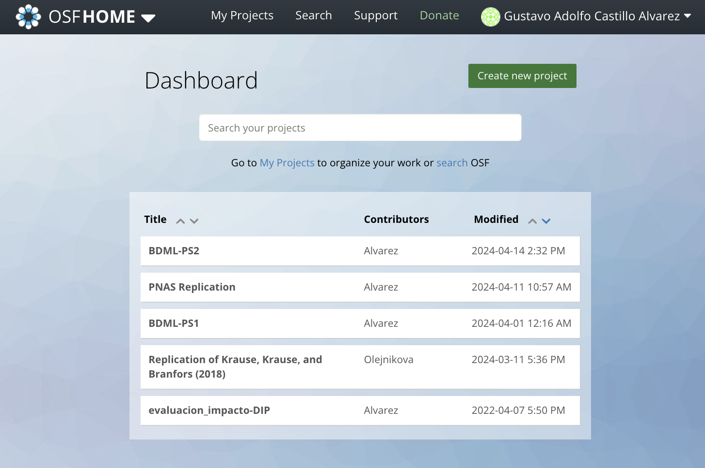
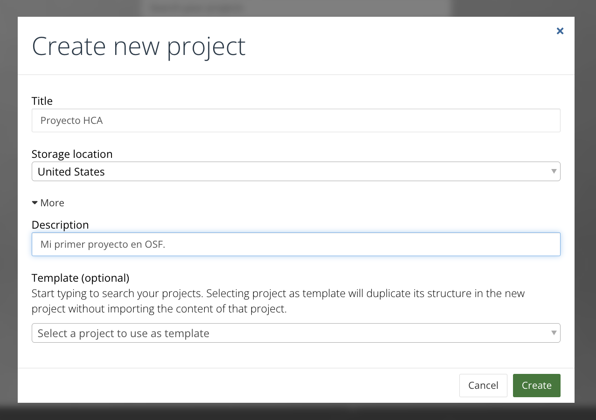
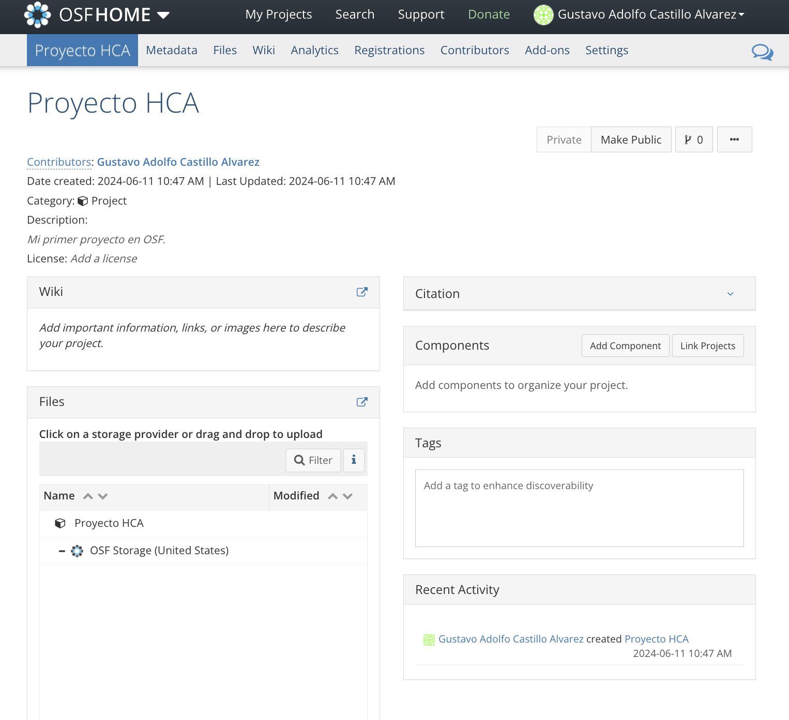
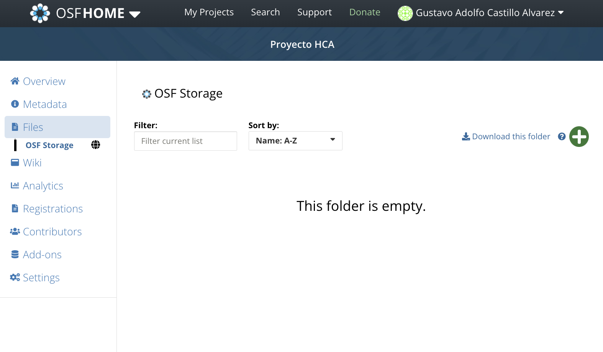

# Datos

## Repositorios de Datos

Los repositorios de datos o generalistas, llamados en inglés [*generalist repositories*](https://sharing.nih.gov/data-management-and-sharing-policy/sharing-scientific-data/generalist-repositories), son plataformas en las que se pueden compartir y almacenar diferentes tipos de datos sin importar del tipo, formato, contenido o enfoque disciplinar. Similares a GitHub o GitLab estos permiten que se pueda crear un enlace para compartir los datos con otras personas. En nuestros casos la mayoría de las veces estos datos serán tabulares, es decir tablas. Algunos repositorios generalistas populares son [**Open Science Framework**](https://osf.io/) creado por el Centro para Ciencia Abierta ([COS](https://www.cos.io/about) por sus siglas en inglés), y [**Zenodo**](https://zenodo.org/) creado en 2013 por el CERN y el proyecto OpenAIRE comisionado por la Comisión Europea.

## ¿Cómo usarlos?

Hagamos un ejercicio aplicado usando [OSF](https://osf.io/). Luego veremos una comparación entre OSF y Zenodo. Si desean explorar otras alternativas de repositorios generalistas diferentes pueden revisar [esta tabla](https://sharing.nih.gov/data-management-and-sharing-policy/sharing-scientific-data/generalist-repositories) comparativa. Luego de tener una cuenta en OSF procederemos a ingresar con nuestros credenciales. 

```{r osfhome, out.width = '33%', echo=FALSE}

```

Luego crearemos un nuevo proyecto haciendo click en el botón verde de "Create new project". Aquí tenemos las siguientes opciones si damos click en "More":

```{r osf-create, echo=FALSE, out.width='60%'}

```


- **Title**: El título de nuestro proyecto
- **Storage location**: La ubicación donde deseamos que se almacenen nuestros archivos. Debemos considerar la cercanía geográfica a nosotros, pues en servidores del país que escojamos se guardarán nuestros archivos. Dado que estamos en latinoamérica escojamos Estados Unidos. 
- **Description**: La descripción de nuestro proyecto/repositorio.
- **Template**: Esto permite crear el proyecto usando otro proyecto como plantilla. Esto es útil si queremos ahorrar tiempo replicando la estructura de otro proyecto previamente creado. 

Una vez creado vamos a "Go to Project" para ver el proyecto que acabamos de crear. Un proyecto vacío se ve como en la Imagen 2 

```{r osf-proj-home, echo=FALSE, out.width='50%'}

```

### Subir archivos

Una vez dentro del proyecto veremos varios paneles como *Wiki*, *Citation*, *Components*, *Files*, *Tags* y *Recent Activity* en la página principal. En el menú superior hay otras opciones que revisaremos posteriormente. Por ahora carguemos los archivos al repositorio.

Para añadir los archivos podemos acceder al 

```{r osf-files-home, echo=FALSE}

```


## Comparación OSF y Zenodo

```{r}
# Create a dataframe
library(tibble)

comparison <- tibble(
  Feature = c("Focus", "DOI Support", "License Flexibility", "Integration", "File Size Limit"),
  OSF = c("Broad academic use", "Yes", "Multiple options", "Strong (GitHub, Dropbox, etc.)", "5 GB per file"),
  Zenodo = c("Research artifacts", "Yes", "Open licenses", "Strong (GitHub, others)", "50 GB per file")
)

# Print the dataframe to check
print(comparison)

```

